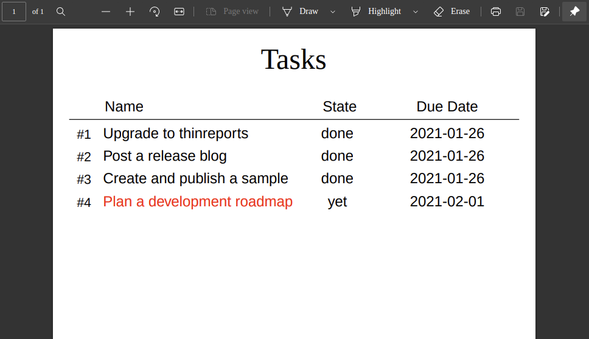

# Thinreports Rails Example

[](https://github.com/thinreports/thinreports-rails-example/actions?query=branch%3Amaster)

A simple task management application using Thinreports and Rails.



## Environments

- Ruby 2.7, 3.0, 3.1, 3.2
- Rails 7.0
- [thinreports-generator](https://github.com/thinreports/thinreports-generator) 0.13.0
- [thinreports-rails](https://github.com/takeshinoda/thinreports-rails) 0.5.0

An sample application with Rails 6.1 can be found in [the rails-6 branch](https://github.com/thinreports/thinreports-rails-example/tree/rails-6).

## Running this application

```
$ bundle install
$ bin/rails db:setup
$ bin/rails s
```

Visit `http://localhost:3000`.

### Using docker-compose

```
$ docker-compose build
$ docker-compose run app bin/rails db:setup
$ docker-compose up -d
```
